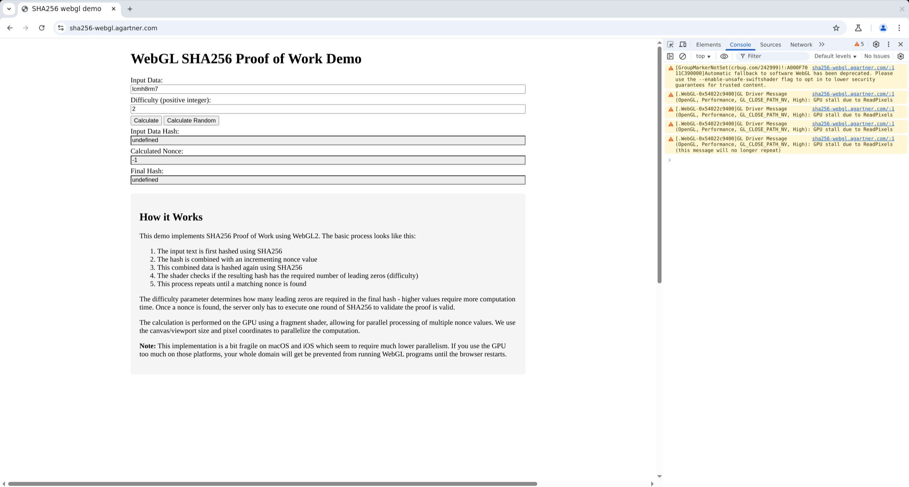

This demo implements SHA256 Proof of Work using WebGL2. The basic process looks like this.

1. The input text is first hashed using SHA256
2. The hash is combined with an incrementing nonce value
3. This combined data is hashed again using SHA256
4. The shader checks if the resulting hash has the required number of leading zeros (difficulty)
5. This process repeats until a matching nonce is found

The difficulty parameter determines how many leading zeros are required in the final hash - higher values require more computation time. Once a nonce is found, the server only has to execute one round of sha256 to validate the proof is valid.

The calculation is performed on the GPU using a fragment shader, allowing for parallel processing of multiple nonce values. We use the canvas/viewport size and pixel coordinates to parallelize the computation.

This is a bit fragile on macOS and iOS which seem to require much lower parallelism. If you use the GPU too much on those platforms, your whole domain will be prevented from running WebGL programs until the browser restarts.

One interesting side effect of this is that chrome running without a GPU cannot solve this challenge:

